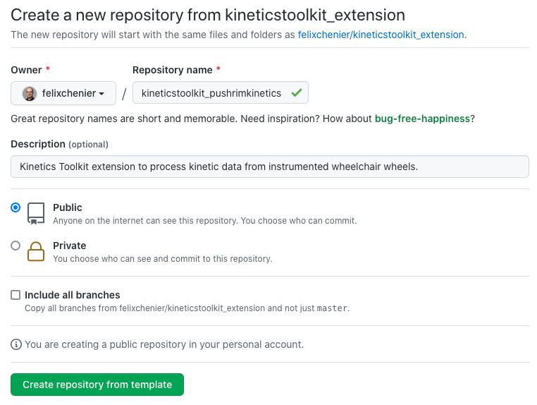

# Developing extensions

Long story short, any installed package which name begins with `kineticstoolkit_` is considered as an extension to Kinetics Toolkit. The [ktk.import_extensions()](api/kineticstoolkit.import_extensions.rst) function will find it and import it into the `ktk.ext` namespace.

If you want to develop and share your own extensions, but do not know how to share python modules or packages, we provide a template and guidelines to get you on road, using the `pip git+https` installation method.

**Step 1.** Install the `pytest` module. This will allow you to write and run unit tests for your extension.

**Step 2.** Find a name for your extension.

**Step 3.** Go to this repository: https://github.com/felixchenier/kineticstoolkit_extension, and use it as a template for your own, new repository. In the following example, we will use `pushrimkinetics` as the extension name.


Name your new repository `kineticstoolkit_EXTENSIONNAME`, replacing EXTENSIONNAME by the name of your extension.



**Step 4.** Clone your new repository on your computer using the git tool of your choice.

**Step 5:** Edit the header of `setup.py` to match your extension and personal information.

````
"""Setup tool for building a pip-accessible package."""

import setuptools

#--------------------------------------------------------------------------------
# Please modify to fit your extension (particularly the text in CAPITALS)
#--------------------------------------------------------------------------------
name = "kineticstoolkit_pushrimkinetics"
description = "Provide functions to process kinetic data from instrumented wheelchair wheels."
url = "https://github.com/felixchenier/kineticstoolkit_pushrimkinetics"
author = "Félix Chénier"
author_email = "chenier.felix@uqam.ca"
#--------------------------------------------------------------------------------
````

**Step 6:** Change `EXTENSIONAME`, `AUTHORNAME`, `AUTHOREMAIL`, `YEAR` and `GITHUBUSER` in every file for their real values.

**Step 7:** Put your actual code in `kineticstoolkit_EXTENSIONNAME.py`.

**Step 8:** Write some test functions in `test_extension.py`. Such test functions usually perform a simple operation and ends with:

```
assert some_variable == some_contents
```

**Step 9:** Check that your extension works. Simply running the `test_extension.py` file should start `pytest` and run your test functions.

**Step 10:** Edit `README.md` to include installation and usage instructions. You can also upload a Jupyter tutorial that shows your extension in action.

**Step 11:** Commit and push your changes.

Your extension can now be installed using:

```
pip install git+https://github.com/USERNAME/kineticstoolkit_EXTENSIONNAME
```

It would be a good idea to test it a last time in a fresh testing environment. If you are using conda:

````
cd
conda create -n test -c conda-forge kineticstoolkit
conda activate test
pip install git+https://github.com/USERNAME/kineticstoolkit_EXTENSIONNAME
````

Now launch python, import kineticstoolkit and try your extension.

**Step 12.** Publicize your extension on the [Kinetics Toolkit's discussions forum](https://github.com/felixchenier/kineticstoolkit/discussions). We'll add it to this page. If things are not as smooth as you'd want, don't hesitate to [ask for help](https://github.com/felixchenier/kineticstoolkit/discussions).
