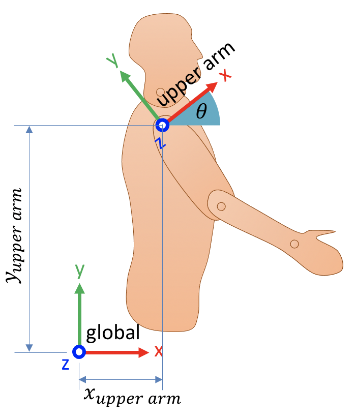
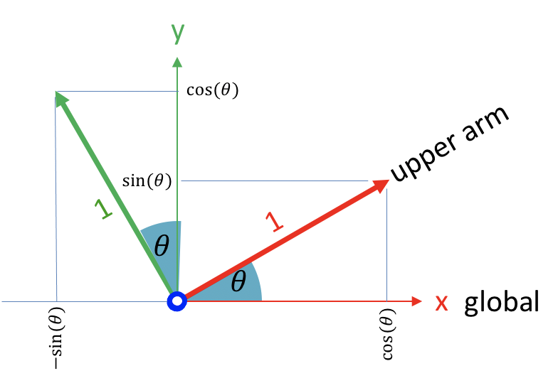
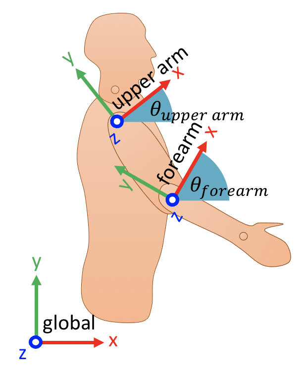

# Coordinates: points, vectors and frames

:::{card} Summary
This section defines the following terms and their representation as 4x1 and 4x4 matrices:

- Global coordinate system
- Local coordinate systems
- Point, vector, frame
:::

The following sections are an introduction or reminder of the basic elements of rigid body geometry. They covers the definitions of bodies, coordinate systems, coordinates (such as points, vectors and frames), and homogeneous transforms. We follow the nomenclature conventions of Craig, J., 1987. Introduction to robotics: Mechanics and control, in the context of rigid body biomechanics. 

While these notions largely come from the robotics field, they will be approached in the scope of rigid body biomechanics. We will use the posture in Figure 1 for most examples. While this is a bidimensional example, we will treat it as a conventional 3D problem, but with all medio-lateral (z axis) coordinates being set to zero.

*Figure 1. The posture used for the next examples.*

## 📄 Global coordinate system

To express any coordinate, we need a coordinate system. A coordinate system is composed of an origin (the point in space everything is expressed relative to) and a set of axes. In human movement biomechanics, we usually use a cartesian system composed of three orthonormal axes (x, y and z).

In newton dynamics and at the human scale, it is totally acceptable to define a global, non-moving coordinate system everything can be referenced to. In Figure 2, we define such a fixed system:

- The origin is approximately at the hip level and posterior to the person;
- The x axis points forward;
- The y axis points upward;
- The z axis points to the right.

This coordinate system is completely arbitrary: any other origin or set of orthonormal axes would still be perfectly valid, as long as we are consistent during the whole analysis. This is the one we chose here, the one every global coordinate will refer to.

*Figure 2. A global coordinate system*

## 📄 Points and vectors

Using the global coordinate system of Figure 2, we can express the position of any point in space using its three components (x, y, z). For example, the position of the shoulder in global coordinates is:

$$
~^\text{global}p_\text{shoulder} = \begin{bmatrix}
x_\text{shoulder} \\
y_\text{shoulder} \\
z_\text{shoulder}
\end{bmatrix}
$$

where $~^\text{global}p_\text{shoulder}$ is read as: Position ($p$) of the shoulder expressed in the global coordinate system.

While three components are sufficient to express points and vectors in three dimensions, we normally use four components instead, the fourth being 1 for points and 0 for vectors. Therefore, while we express the **position** (a point) of the shoulder in global coordinates as:

$$
~^\text{global}p_\text{shoulder} = \begin{bmatrix}
x_\text{shoulder} \\
y_\text{shoulder} \\
z_\text{shoulder} \\ 1
\end{bmatrix}
$$

we would express its **velocity** (a vector) as:

$$
~^\text{global}\vec{v}_\text{shoulder} = \begin{bmatrix}
v_\text{x shoulder} \\
v_\text{y shoulder} \\
v_\text{z shoulder} \\ 0
\end{bmatrix}
$$

## 📄 Local coordinate system

While points and vectors are generally relatively easy to express in a given coordinate system, the orientation of a segment is more complex. In Figure 2, we would explicitly need this information to express the orientation of the upper arm:

- What is the initial, non-rotated orientation of the upper arm?
- By how many degrees has it been rotated from its initial orientation?
- Around which axes?

The first step to answer these questions is to create a **local coordinate system** for the upper arm. This local coordinate system will be attached to the upper arm, and thus will move with it. To create such a coordinate system, we need to define where is the origin and orthonormal axes of the upper arm, in respect to the upper arm. In this example, we use the anatomical position as a reference to define this coordinate system (Figure 3):

- The origin of the upper arm coordinate system is located at the shoulder;
- Its x axis points forward;
- Its y axis is aligned with the arm, pointing upward;
- Its z axis points to the right.

*Figure 3. Local coordinate system of the upper arm.*

Now that we defined this local coordinate system, we can come back to the position of interest of Figure 1. Look in Figure 4 how the upper arm coordinate system is attached to the upper arm and thus moves with it.

*Figure 4. Expressing the position and orientation of the upper arm.*

## 📄 Frames

We are now ready to introduce the **frame**, a 4x4 matrix that expresses both the position and the orientation of a coordinate system, in reference to another coordinate system.

The fourth (easiest) column of a frame is the position of the local coordinate system's origin expressed in the reference coordinate system. In the example of Figure 4, this is:

$$
~^\text{global}p_\text{upper arm} = \begin{bmatrix}
x_\text{upper arm} \\
y_\text{upper arm} \\
z_\text{upper arm} \\
1
\end{bmatrix}
$$

The first three columns of a frame express the frame orientation. They are, in the reference coordinate system, the coordinates of three unit vectors that are respectively oriented toward the x, y and z axes of the local coordinate system.

*Figure 5. Orientation of the upper arm coordinate system (bold lines) in reference to the global coordinate system (thin lines).*

Based on Figure 5, which illustrates this concept for the pose of Figure 4, here is how we would express these three unit vectors in both coordinate systems:

|                  |        In the upper arm coordinate system        |                     In the global coordinate system                     |
| ----------------:|:------------------------------------------------:|:-----------------------------------------------------------------------:|
| Upper arm x axis | $\begin{bmatrix} 1 \\ 0 \\ 0 \\ 0 \end{bmatrix}$ | $\begin{bmatrix} \cos(\theta) \\ \sin(\theta) \\ 0 \\ 0 \end{bmatrix}$  |
| Upper arm y axis | $\begin{bmatrix} 0 \\ 1 \\ 0 \\ 0 \end{bmatrix}$ | $\begin{bmatrix} -\sin(\theta) \\ \cos(\theta) \\ 0 \\ 0 \end{bmatrix}$ |
| Upper arm z axis | $\begin{bmatrix} 0 \\ 0 \\ 1 \\ 0 \end{bmatrix}$ |            $\begin{bmatrix} 0 \\ 0 \\ 1 \\ 0 \end{bmatrix}$             |

Combining these four vectors into a single 4x4 matrix gives the frame $~^\text{global}_\text{upper arm}T$:

$$
~^\text{global}_\text{upper arm}T = \begin{bmatrix}
\cos(\theta) & -\sin(\theta) & 0 & x_\text{upper arm} \\
\sin(\theta) & \cos(\theta) & 0 & y_\text{upper arm} \\
0 & 0 & 1 & z_\text{upper arm} \\
0 & 0 & 0 & 1
\end{bmatrix}
$$

where the expression $~^\text{global}_\text{upper arm}T$ is read as: Position and orientation of the upper arm coordinate system, expressed in the global coordinate system.

For example, if the shoulder is located 15 cm forward and 70 cm upward to the global origin, and the upper arm is inclined at 30 degrees of the vertical, then the position and orientation of the upper arm coordinate system is expressed by the frame:

$$
~^\text{global}_\text{upper arm}T = \begin{bmatrix}
\cos(30) & -\sin(30) & 0 & 0.15 \\
\sin(30) & \cos(30) & 0 & 0.7 \\
0 & 0 & 1 & 0 \\
0 & 0 & 0 & 1
\end{bmatrix} \\=
\begin{bmatrix}
0.866 & -0.5 & 0 & 0.15 \\
0.5 & 0.866 & 0 & 0.7 \\
0 & 0 & 1 & 0 \\
0 & 0 & 0 & 1
\end{bmatrix}
$$

:::{important}
Independently of the position and orientation of the studied body, a frame always has this form:

$$
\begin{bmatrix}
R_{11} & R_{12} & R_{13} & P_x \\
R_{21} & R_{22} & R_{23} & P_y \\
R_{31} & R_{32} & R_{33} & P_z \\
0      & 0      & 0      & 1
\end{bmatrix}
$$

where:

- the $R$ sub-matrix is a function of three rotation angles and represents the orientation of the local coordinate system;
- the $P$ vector is the position of the local coordinate system's origin.
:::

## 💪 Exercise

Figure 6 shows rotated local coordinate systems for both the upper arm and forearm. Knowing that the position of the elbow in global coordinates is $(0.34, 0.371, 0)$, and that the forearm is inclined by $50^\circ$ compared to the global reference frame, construct this 4x4 matrix: $^\text{global} _\text{forearm} T$.

*Figure 6. Local coordinates for both the upper arm and the forearm*

:::{toggle}

$$
~^\text{global}_\text{forearm}T = \begin{bmatrix}
\cos(50) & -\sin(50) & 0 & 0.34 \\
\sin(50) & \cos(50) & 0 & 0.371 \\
0 & 0 & 1 & 0 \\
0 & 0 & 0 & 1
\end{bmatrix} \\=
\begin{bmatrix}
0.643 & -0.766 & 0 & 0.34 \\
0.766 & 0.643 & 0 & 0.371 \\
0 & 0 & 1 & 0 \\
0 & 0 & 0 & 1
\end{bmatrix}
$$

:::
