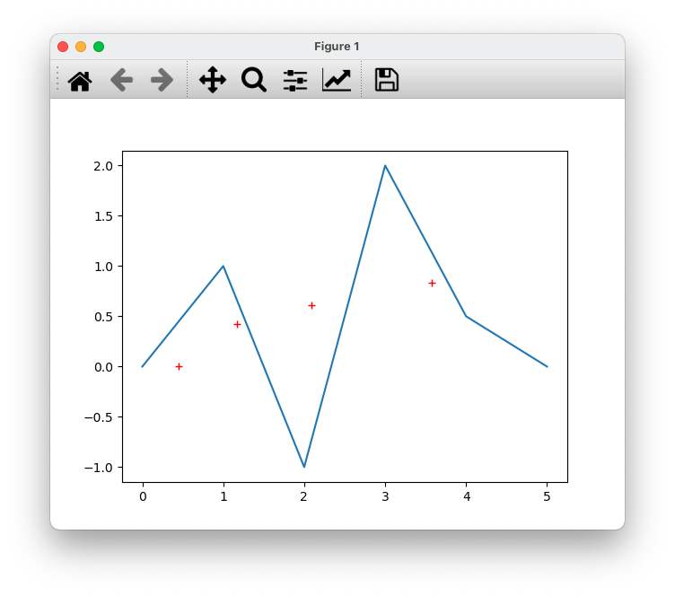

---
jupytext:
  text_representation:
    extension: .md
    format_name: myst
    format_version: 0.13
    jupytext_version: 1.14.4
kernelspec:
  display_name: Python 3 (ipykernel)
  language: python
  name: python3
---

# 📖 Graphical input

:::{card} Summary
This section presents the {{plt_ginput}} function, that allows a user to interactively get coordinates from a figure.
:::

Matplotlib provides extensive options to interact with figures, with different levels of complexity. The most basic one and one of the most helpful is {{plt_ginput}}. It allows the user to click on a number of points on the figure, and then returns these coordinates. For instance, these instructions:

```
import matplotlib.pyplot as plt

plt.plot([0.0, 1.0, -1.0, 2.0, 0.5, 0.0])
points = plt.ginput(10)  # 10 points
```

generate the figure above, and let the user draw a maximum of 10 points.



- Left-click adds a point (red cross);
- Right-click removes the last added point;
- Middle-click stops and returns the current points.

The function then returns the point coordinates as a list of (x, y) tuples.

```{code-cell} ipython3
:tags: [remove-cell]

points = [
    (0.44858870967741926, 0.003571428571428781),
    (1.1693548387096775, 0.42321428571428577),
    (2.089717741935484, 0.6107142857142862),
    (3.5756048387096775, 0.8339285714285718),
]
```

```{code-cell} ipython3
points
```

## 💪 Exercise

You recorded a force using a force sensor at a sampling frequency of 10 Hz. Here are the 44 first samples of this signal:

```
force = [
    0.37571429, 0.39095238, 0.38333333, 0.37190476, 0.37952381, 0.36809524,
    0.40238095, 0.37571429, 0.37571429, 0.37571429, 0.39857143, 0.36047619,
    0.38333333, 0.36428571, 0.74142857, 0.97      , 0.29952381, 0.41761905,
    0.33380952, 0.38333333, 0.35285714, 0.37571429, 0.36428571, 0.38333333,
    0.36809524, 0.37571429, 0.36428571, 0.37571429, 0.38333333, 0.36047619,
    0.37571429, 0.36047619, 0.37190476, 0.36809524, 0.35285714, 0.35666667,
    0.37190476, 0.38333333, 0.36809524, 0.38333333, 0.36809524, 0.36428571,
    0.37571429, 0.36047619
]
     
time = [
    0. , 0.1, 0.2, 0.3, 0.4, 0.5, 0.6, 0.7, 0.8, 0.9, 1. , 1.1, 1.2,
    1.3, 1.4, 1.5, 1.6, 1.7, 1.8, 1.9, 2. , 2.1, 2.2, 2.3, 2.4, 2.5,
    2.6, 2.7, 2.8, 2.9, 3. , 3.1, 3.2, 3.3, 3.4, 3.5, 3.6, 3.7, 3.8,
    3.9, 4. , 4.1, 4.2, 4.3
]
```

```{code-cell} ipython3
:tags: [remove-input]

import matplotlib.pyplot as plt
import numpy as np

force = [
    0.37571429, 0.39095238, 0.38333333, 0.37190476, 0.37952381, 0.36809524,
    0.40238095, 0.37571429, 0.37571429, 0.37571429, 0.39857143, 0.36047619,
    0.38333333, 0.36428571, 0.74142857, 0.97      , 0.29952381, 0.41761905,
    0.33380952, 0.38333333, 0.35285714, 0.37571429, 0.36428571, 0.38333333,
    0.36809524, 0.37571429, 0.36428571, 0.37571429, 0.38333333, 0.36047619,
    0.37571429, 0.36047619, 0.37190476, 0.36809524, 0.35285714, 0.35666667,
    0.37190476, 0.38333333, 0.36809524, 0.38333333, 0.36809524, 0.36428571,
    0.37571429, 0.36047619
]
     
time = [
    0. , 0.1, 0.2, 0.3, 0.4, 0.5, 0.6, 0.7, 0.8, 0.9, 1. , 1.1, 1.2,
    1.3, 1.4, 1.5, 1.6, 1.7, 1.8, 1.9, 2. , 2.1, 2.2, 2.3, 2.4, 2.5,
    2.6, 2.7, 2.8, 2.9, 3. , 3.1, 3.2, 3.3, 3.4, 3.5, 3.6, 3.7, 3.8,
    3.9, 4. , 4.1, 4.2, 4.3
]

plt.plot(time, force)
plt.xlabel("Time (s)")
plt.ylabel("Force (uncalibrated signal in volts)")
plt.show()
```

This force spike was deliberately generated as a synchronization signal, by gently impacting the force sensor. This impact was also recorded by other instruments, to synchronize every instrument on this impact. To this effect, we must read the time at which the spike occurs in the signal above.

Rather than reading it approximately on the curve, write a function that plots the signal, that waits for a user to click on the spike, and that returns the spike time in seconds.

:::{toggle}
```
import matplotlib.pyplot as plt
import numpy as np


def get_spike_time(time, force):
    plt.plot(time, force)
    points = plt.ginput(1)
    return points[0][0]  # Coordinate 0 (x) of point 0 (1st and only point)
```
:::
