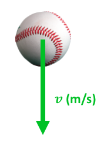
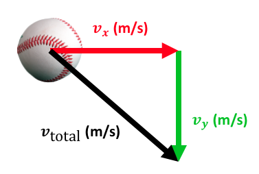
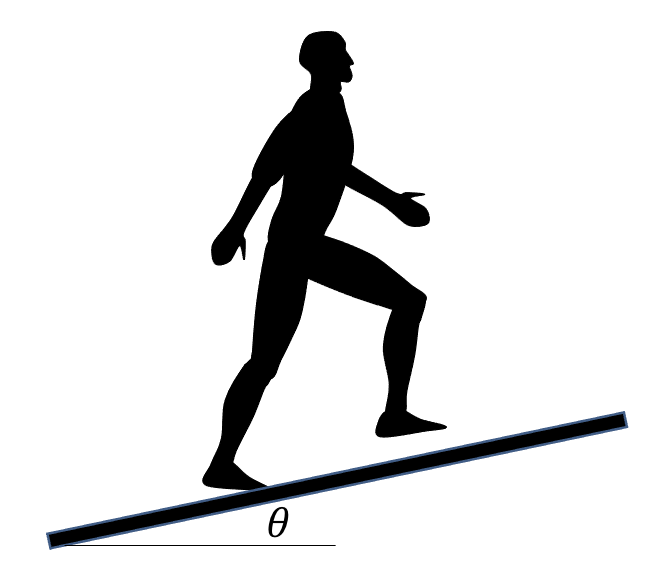

---
jupytext:
  text_representation:
    extension: .md
    format_name: myst
    format_version: 0.13
    jupytext_version: 1.14.4
kernelspec:
  display_name: Python 3 (ipykernel)
  language: python
  name: python3
---

```{code-cell} ipython3
:tags: [remove-cell]

%matplotlib inline
```

# Arithmetics and comparisons

:::{card} Summary
This section shows how to perform arithmetic operations and comparisons between arrays and between arrays and numbers. It also introduces:

- Special constants and related functions:
    - {{np_pi}}
    - {{np_inf}}
    - {{np_nan}}
    - {{np_isinf}}
    - {{np_isnan}}
- Trigonometric functions:
    - {{np_sin}}, {{np_cos}}, {{np_tan}}
    - {{np_arcsin}}, {{np_arccos}}, {{np_arctan}}, {{np_arctan2}}
    - {{np_deg2rad}}, {{np_rad2deg}}
    - {{np_abs}}
    - {{np_sqrt}}
- Statistical functions:
    - {{np_sum}}, {{np_nansum}}
    - {{np_mean}}, {{np_nanmean}}
    - {{np_std}}, {{np_nanstd}}
    - {{np_min}}, {{np_nanmin}}
    - {{np_max}}, {{np_nanmax}}
    - {{np_median}}, {{np_nanmedian}}
    - {{np_quantile}}, {{np_nanquantile}}
:::

## 📄 Basic arithmetics

All Python arithmetic operators (`+`, `-`, `*`, `/`, `**`) work directly on NumPy arrays, assuming both arrays have the same shape. Operations are performed between each element of a same index (e.g., using `a + b`, the 1st element of `a` is summed with the 1st element of `b`, the 2nd of `a` with the 2nd of `b`, and so on). For example:

```{code-cell} ipython3
import numpy as np
import matplotlib.pyplot as plt

a = np.array(
    [
        [1.0, 2.0, 3.0],
        [1.0, 2.0, 3.0],
    ]
)

b = np.array(
    [
        [1.0, 1.0, 1.0],
        [2.0, 2.0, 2.0],
    ]
)
```

Addition:

```{code-cell} ipython3
a + b
```

Subtraction:

```{code-cell} ipython3
a - b
```

Multiplication:

```{code-cell} ipython3
a * b
```

Division:

```{code-cell} ipython3
a / b
```

Exponent:

```{code-cell} ipython3
a**b
```

It is also possible to perform operations between an array and a single number.

Addition:

```{code-cell} ipython3
a + 1
```

Subtraction:

```{code-cell} ipython3
a - 1
```

etc.

:::{note}
It is also possible to perform arithmetic operations between arrays that do not completely match shape using {{np_broadcasting}} (not seen in this tutorial).
:::

## 💪 Exercise 1

A ball is released from a point in air. Knowing that it was immobile when it was released, and that it gains negative speed at a rate of 9.81 m/s², plot a curve of its velocity during one second from release time.



::::{tip}
:::{toggle}
Start by creating a time array using {{np_arange}} or {{np_linspace}}. Then, use this time array to create a velocity array.
:::
::::

```{code-cell} ipython3
:tags: [hide-cell]

# First, let's define a time array
t = np.linspace(0, 1, 100, endpoint=False)

# Calculate the velocity as -9.81 * t
v = -9.81 * t

# Show it
plt.plot(t, v)
plt.xlabel("Time (s)")
plt.ylabel("Velocity (m/s)")
plt.grid(True)
plt.show()
```

## 📄 Matrix multiplication

Numpy also provides an operator `@` that calculates the matrix dot product. For instance, to perform this operation:

$$
\begin{bmatrix}
1 & 2 & 3 \\
4 & 5 & 6 \\
7 & 8 & 9
\end{bmatrix}
\begin{bmatrix}
1 \\ 2 \\ 3
\end{bmatrix}
$$

which is:

$$
\begin{bmatrix}
(1 * 1) + (2 * 2) + (3 * 3)\\
(4 * 1) + (5 * 2) + (6 * 3)\\
(7 * 1) + (8 * 2) + (9 * 3)
\end{bmatrix}
=
\begin{bmatrix}
14 \\ 32 \\ 50
\end{bmatrix}
$$

we simply write:

```{code-cell} ipython3
a = np.array(
    [
        [1.0, 2.0, 3.0],
        [4.0, 5.0, 6.0],
        [7.0, 8.0, 9.0],
    ]
)

b = np.array([1.0, 2.0, 3.0])

a @ b
```

## 📄 Comparisons

Comparison operators also work natively on NumPy arrays. For example:

```{code-cell} ipython3
a = np.array(
    [
        [1.0, 2.0, 3.0],
        [4.0, 5.0, 6.0],
        [7.0, 8.0, 9.0],
    ]
)

a > 5.0
```

```{code-cell} ipython3
a == 5.0
```

```{code-cell} ipython3
a >= 5.0
```

## 📄 Infinity and Not-A-Number (nan)

Some arithmetic operations such as division by zero lead to infinity of undertermined numbers, which normally result in an error:

```{code-cell} ipython3
:tags: [raises-exception]

1 / 0
```

Since an operation on arrays performs many operations at once, it would be inconvenient to get an error each time only a few calculations failed. For this matter, instead of generating errors, NumPy only warns and provides special constants to express infinity {{np_inf}} and undetermined numbers {{np_nan}} (not-a-number):

```{code-cell} ipython3
a = np.array([0.0, 1.0, -1.0, 1.0])
b = np.array([0.0, 0.0, 0.0, 1.0])

c = a / b

c
```

To know which operations resulted in `nan` or `inf`, we use {{np_isnan}} and {{np_isinf}}:

```{code-cell} ipython3
np.isnan(c)
```

```{code-cell} ipython3
np.isinf(c)
```

:::{good-practice} Missing data
It is common in data analysis to use `np.nan` for representing missing data. For instance, we could record the (x, y, z) trajectory of a reflective marker and use (`nan`, `nan`, `nan`) when the marker is not seen by the cameras.
:::

## 📄 Trigonometry

In addition to arithmetical operators, NumPy provides lots of essential functions and constants to perform trigonometrical operations:

- {{np_pi}}: π
- {{np_sin}}: Sinus
- {{np_cos}}: Cosinus
- {{np_tan}}: Tangent
- {{np_arcsin}}: Arc-sinus
- {{np_arccos}}: Arc-cosinus
- {{np_arctan}}: Arc-tangent
- {{np_arctan2}}: Art-tangent in the full plane, contrarily to {{np_arctan}} that only returns values from -π/2 (-90°) to +π (+90°)
- {{np_deg2rad}}: Convert degrees to radians
- {{np_rad2deg}}: Convert radians to degrees
- {{np_abs}}: Absolute value
- {{np_sqrt}}: Square root

In all trigonometric functions, angles are in radians by default. You can either convert to/from degrees by multiplying or dividing by $\pi/180$ manually, or use {{np_deg2rad}} and {{np_rad2deg}}.

```{code-cell} ipython3
angle = np.linspace(0, 2 * np.pi, 100)

plt.plot(angle, np.sin(angle))
plt.show()
```

## 💪 Exercise 2

A ball is threw horizontally with a constant horizontal velocity of 10 m/s, and with no initial vertical velocity at release time. Once released, its horizontal velocity stays constant while its vertical velocity increases negatively at a rate of 9.81 m/s². Plot a curve of its total speed during one second from release time. The total speed is the norm of the vector created by the horizontal velocity and the vertical velocity:



::::{tip}
:::{toggle}
You already calculated the vertical velocity `v_y` in the previous exercise. Now use the Pythagorean theorem using arithmetic operations on arrays to calculate the total speed `v_total` based on `v_x` and `v_y`.
:::
::::

```{code-cell} ipython3
:tags: [hide-cell]

# First, let's define a time array
t = np.linspace(0, 1, 100, endpoint=False)

# Calculate the vertical velocity as -9.81 * t
v_y = -9.81 * t

# Constant horizontal speed of 10 m/s2
v_x = 10

# Calculate the total speed
v_total = np.sqrt(v_x**2 + v_y**2)

# Plot it
plt.plot(t, v_total)
plt.xlabel("Time (s)")
plt.ylabel("Total speed (m/s)")
plt.grid()
plt.show()
```

## 💪 Exercise 3

When we walk on an inclined treadmill, we must overcome a backward force equal to:

$$
F = m g \sin \theta
$$

where $m$ is the person's mass, $g$ is 9.81 m/s² and $\theta$ is the treadmill angle. Write a function that takes the mass as an argument, and that plots $F$ for $\theta \in [-20, 20]$ degrees. Then, test your function for $m = 65$ kg.



```{code-cell} ipython3
:tags: [hide-cell]

def plot_force(m: float) -> None:
    """
    Plot the force a persons need to overcome on an inclined treadmill.

    Parameters
    ----------
    m :
        Mass of the person in kilograms

    Returns
    -------
    None

    """
    # First, let's define an angle array
    theta = np.linspace(-30, 30, 100, endpoint=False)

    # Calculate the force
    force = m * 9.81 * np.sin(np.deg2rad(theta))

    # Plot it
    plt.plot(theta, force)
    plt.xlabel("Angle (deg)")
    plt.ylabel("Force (N)")
    plt.show()


# Test the function
plot_force(65)
```

## 📄 Statistical functions

NumPy also provides statistical functions such as {{np_sum}}, {{np_mean}}, {{np_std}}, {{np_min}}, {{np_max}}, {{np_median}}, and {{np_quantile}}. For multidimensional arrays, these functions accept an `axis` parameter that indicates which axis to perform the operation on. For example, for a matrix, an operation on the first axis is performed on the **lines**:

```{code-cell} ipython3
a = np.array(
    [
        [1.0, 2.0, 3.0],
        [4.0, 5.0, 6.0],
    ]
)

print(f"Sum on first axis = {np.sum(a, axis=0)}")
print(f"Max on first axis = {np.max(a, axis=0)}")
```

Whereas an operation on the second axis is performed on the **columns**:

```{code-cell} ipython3
print(f"Sum on second axis = {np.sum(a, axis=1)}")
print(f"Max on second axis = {np.max(a, axis=1)}")
```

If the array contains `nan` values, using these functions can be problematic because any arithmetic operation that includes `nan` results in `nan`:

```{code-cell} ipython3
a = np.array(
    [
        [1.0, 2.0, 3.0],
        [4.0, np.nan, 6.0],
    ]
)

print(f"Sum on first axis = {np.sum(a, axis=0)}")
print(f"Max on first axis = {np.max(a, axis=0)}")
```

For these cases, NumPy provides alternate functions: {{np_nansum}}, {{np_nanmean}}, {{np_nanstd}}, {{np_nanmin}}, {{np_nanmax}}, {{np_nanmedian}}, {{np_nanquantile}} that ignore `nan` values from the calculation.

```{code-cell} ipython3
print(f"Sum on first axis = {np.nansum(a, axis=0)}")
print(f"Max on first axis = {np.nanmax(a, axis=0)}")
```

## 💪 Exercise

We recorded this series of forces using a gait force platform, where the first axis corresponds to time and the second axis corresponds to $F_x$, $F_y$ and $F_z$.

```{code-cell} ipython3
forces = np.array(
    [
        [0.17619048, 0.82380952, 17.61904762],
        [0.21428571, 0.78571429, 21.42857143],
        [0.17619048, 0.82380952, 17.61904762],
        [0.17619048, 0.82380952, 17.61904762],
        [0.17619048, 0.82380952, 17.61904762],
        [0.32857143, 0.67142857, 32.85714286],
        [0.25238095, 0.74761905, 25.23809524],
        [0.17619048, 0.82380952, 17.61904762],
        [0.29047619, 0.70952381, 29.04761905],
        [0.32857143, 0.67142857, 32.85714286],
        [0.25238095, 0.74761905, 25.23809524],
        [0.21428571, 0.78571429, 21.42857143],
        [0.67142857, 0.32857143, 67.14285714],
        [8.1, -7.1, 810.0],
        [8.70952381, -7.70952381, 870.95238095],
        [8.02380952, -7.02380952, 802.38095238],
        [7.26190476, -6.26190476, 726.19047619],
        [7.75714286, -6.75714286, 775.71428571],
        [9.47142857, -8.47142857, 947.14285714],
        [9.85238095, -8.85238095, 985.23809524],
        [9.54761905, -8.54761905, 954.76190476],
        [8.63333333, -7.63333333, 863.33333333],
        [7.83333333, -6.83333333, 783.33333333],
        [6.76666667, -5.76666667, 676.66666667],
        [5.2047619, -4.2047619, 520.47619048],
        [2.95714286, -1.95714286, 295.71428571],
        [1.50952381, -0.50952381, 150.95238095],
        [0.48095238, 0.51904762, 48.0952381],
        [-0.01428571, 1.01428571, -1.42857143],
        [0.02380952, 0.97619048, 2.38095238],
        [0.17619048, 0.82380952, 17.61904762],
        [0.02380952, 0.97619048, 2.38095238],
        [0.06190476, 0.93809524, 6.19047619],
        [0.06190476, 0.93809524, 6.19047619],
        [0.06190476, 0.93809524, 6.19047619],
        [0.02380952, 0.97619048, 2.38095238],
        [0.06190476, 0.93809524, 6.19047619],
        [0.13809524, 0.86190476, 13.80952381],
    ]
)
```

```{code-cell} ipython3
:tags: [remove-input]

import kineticstoolkit.lab as ktk
plt.plot(forces)
plt.xlabel("# sample")
plt.ylabel("Force (N)")
plt.legend(["Fx", "Fy", "Fz"])
plt.show()
```

1. Write one code line that calculates the three mean forces $\overline{F_x}$, $\overline{F_y}$ and $\overline{F_z}$ over the whole time span.
2. Write one code line that calculates the series of resulting force ($F_\text{tot} = \sqrt{F_x^2 + F_y^2 + F_z^2}$) at each time.
3. Write one code line that calculates the mean resulting force $\overline{F_\text{tot}}$ over the whole time span.

```{code-cell} ipython3
:tags: [hide-cell]

# 1.
print("== 1 ==")
print(
    np.mean(forces, axis=0),
)

# 2.
print("== 2 ==")
print(
    np.sqrt(np.sum(forces**2, axis=1)),
)

# 3.
print("== 3 ==")
print(
    np.mean(np.sqrt(np.sum(forces**2, axis=1)), axis=0),
)
```
