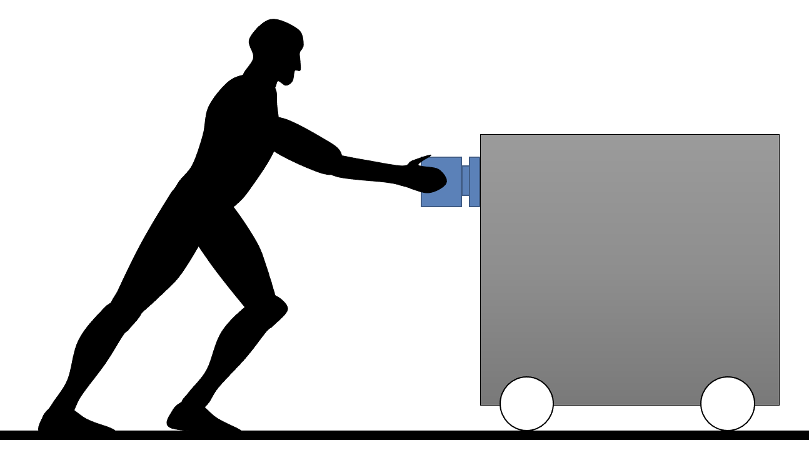

---
jupytext:
  text_representation:
    extension: .md
    format_name: myst
    format_version: 0.13
    jupytext_version: 1.14.0
kernelspec:
  display_name: Python 3 (ipykernel)
  language: python
  name: python3
---

```{code-cell} ipython3
:tags: [remove-cell]

%matplotlib inline
```

# 💪 Exercise 4

Someone pushes a carriage using a dynamometer. The push force is measured in newtons every tenth of a second, during five seconds.



```{code-cell}
push_force = [
    91.19, 99.22, 93.11, 91.76, 94.93, 96.54, 92.27, 96.01, 92.48,
    94.89, 91.55, 90.82, 97.91, 93.19, 95.65, 93.07, 93.65, 90.57,
    98.71, 99.97, 95.72, 96.27, 92.67, 93.4 , 98.84, 92.63, 97.03,
    93.93, 98.34, 95.82, 99.39, 99.29, 92.74, 90.29, 94.57, 90.69,
    93.16, 95.01, 93.16, 97.04, 97.23, 98.9 , 90.26, 97.46, 92.4 ,
    90.84, 97.39, 93.56, 97.47, 93.93
]
```

At the same time, an odometer reports the carriage speed in m/s, also every tenth of a second.

```{code-cell}
carriage_speed = [
    1.05, 1.08, 1.04, 1.09, 1.04, 1.06, 1.04, 1.05, 1.05, 1.05, 1.04,
    1.01, 1.09, 1.09, 1.05, 1.01, 1.06, 1.03, 1.08, 1.08, 1.09, 1.00,
    1.00, 1.00, 1.01, 1.05, 1.06, 1.03, 1.07, 1.02, 1.03, 1.07, 1.07,
    1.02, 1.04, 1.06, 1.00, 1.01, 1.00, 1.04, 1.08, 1.00, 1.02, 1.06,
    1.03, 1.06, 1.05, 1.01, 1.04, 1.00,
]
```

Write this function, knowing that power equals force times speed:

```
def calculate_power(force, speed):
    """
    Calculate the power according to force and speed.

    Parameters
    ----------
    force : list[float]
        A list of forces in newtons.
    speed : list[float]
        A list of speeds in m/s. Its length must be the same as force.

    Returns
    -------
    list[float]
        A list of powers in watts.

    """
```

and use it to calculate the power developed by the person to push the carriage.

```{code-cell}
:tags: [hide-cell]

def calculate_power(force, speed):
    power = []  # Initialize the output list
    
    for i in range(len(force)):
        power.append(force[i] * speed[i])

    return power

# Test the function with the supplied data
calculate_power(push_force, carriage_speed)
```
