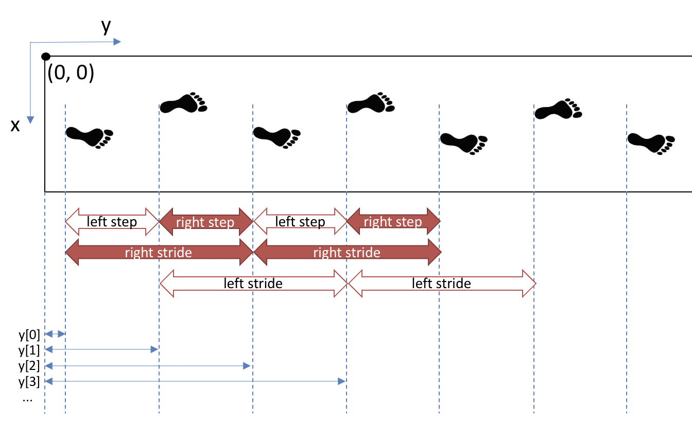

---
jupytext:
  text_representation:
    extension: .md
    format_name: myst
    format_version: 0.13
    jupytext_version: 1.14.0
kernelspec:
  display_name: Python 3 (ipykernel)
  language: python
  name: python3
---

# 📖 Looping using `for` and `range`

:::{card} Summary
This section shows how to repeat a code block using the `for` statement, either by looping through a variable directly, or using a range.
:::

In the previous section, we learned how to use `while` to repeat a code block as long as a condition is true. Whereas the `while` statement is very powerful and sufficient for any looping, it is sometimes clearer to use the `for` statement instead.

The `for` statement means: "repeat this code block for each element of this variable". This means that we can easily iterate through each element of a list:

```
for variable_name in the_list:
    instruction1
    instruction2
    instruction3
    etc.
```

For example:

```{code-cell}
for item in [0, 1, 2, 'three', 'four']:
    print("The current item is:", item)
```


## 💪 Exercise 1

We have some measurements in metres:

```{code-cell}
meters = [0.329, 0.009, 0.210, 0.726, 0.686, 0.912, 0.285, 0.833, 0.334, 0.165]
```

In [previous section](python_while.md), we created a list named `millimeters` by multiplying every element of `meters` by 1000, using a `while` loop:

```{code-cell}
# Create an empty list of the same measurements in millimeters, that we will
# fill up using a while loop.
millimeters = []

# Multiply each element of meters by 1000, and append it to the millimeters list.
i = 0
while i < len(meters):
    millimeters.append(meters[i] * 1000)
    i += 1

# Done.
millimeters
```

This time, create a similar code using a `for` loop instead of a `while` loop.

```{code-cell}
:tags: [hide-cell]

# Create an empty list of the same measurements in millimeters, that we will
# fill up using a for loop.
millimeters = []

# Multiply each element of meters by 1000, and append it to the millimeters list.
for one_measurement in meters:
    millimeters.append(one_measurement * 1000)

# Done.
millimeters
```

:::{good-practice} for vs while
Note how the solution of this exercise is much clearer using `for` than `while`: we don't need to initialize an index at 0 before starting the loop, and we don't need to manually increment the index at the end of each loop. Therefore, in this case, using a `for` loop is less error-prone than using a `while` loop.
:::


## 📄 Range

A range is a type of variable that specifies a series of values from a starting point to an ending point, and with a given increment. Since a range makes an ideal counter, it is often used with `for` loops, when we just need to repeat a code block a given number of time:

```{code-cell}
for i in range(5):  # Repeat the following code block 5 times
    print("The variable i is:", i)
```

In this example, the `range` function creates a sequence of values from 0 (inclusive) to 5 (exclusive), and `i` takes each of these values sequentially. It is possible to create more complex ranges, by using one of the three forms of the `range` function:

- `range(end)`
- `range(begin, end)`
- `range(begin, end, step)`

Creating ranges is very similar to usual [slicing](python_lists_slicing.md), with `begin` being inclusive and `end` being exclusive. Some examples:

```{code-cell}
# Count from 5 to 9
for i in range(5, 10):
    print("The variable i is:", i)
```

```{code-cell}
# Count from 0 to 8 by steps of 2
for i in range(0, 10, 2):
    print("The variable i is:", i)
```

```{code-cell}
# Count from 5 to 9 by steps of 2
for i in range(5, 10, 2):
    print("The variable i is:", i)
```


## 💪 Exercise 2

A therapist measures a patient's maximal shoulder flexion **three times**. Write a program that creates a list of these three measurements based on user input, following this example:

:::{admonition} Example of program output
```none
Enter max shoulder flexion (deg) [measurement 1]: <User enters 119>
Enter max shoulder flexion (deg) [measurement 2]: <User enters 124>
Enter max shoulder flexion (deg) [measurement 3]: <User enters 123>
Max shoulder flexion: [119.0, 124.0, 123.0]
```
:::

:::{toggle}
```
# Initialize an empty list of measurements
measurements = []

# Ask the values
for i in range(3):
    str_value = input(
        f"Enter max shoulder flexion (deg) [measurement {i}]: "
    )
    measurements.append(float(str_value))

# Print the result
print("Max shoulder flexion:", measurements)
```
:::


## 💪 Exercise 3

We return yet again to the instrumented walkway example. We recorded the following positions of heel strike, first for the right heel, second for the left heel, third for the right heel, etc.:

```{code-cell}
# y-coordinates of each heel strike, in meters
y = [0.13, 0.72, 1.29, 1.93, 2.55, 3.12, 3.71, 4.34, 4.95, 5.56]
```



*Figure 1. Foot coordinates obtained via an instrumented walkway*

Write a program that creates a list named `step_lengths`, that contains the length of every step, but this time using `for` and `range` instead of `while`. The first step length would be `y[1] - y[0]`, the second would be `y[2] - y[1]`, etc. In this specific example, we recorded nine steps, but your code must work on any number of steps.

```{code-cell}
:tags: [hide-cell]

# y-coordinates of each heel strike, in meters
y = [0.13, 0.72, 1.29, 1.93, 2.55, 3.12, 3.71, 4.34, 4.95, 5.56]

# Initialize an empty list to put the results of our calculations
step_lengths = []

# Count the number of steps in this set of data
n_steps = len(y) - 1

# Calculate the step lengths
for i in range(n_steps):
    step_lengths.append(y[i + 1] - y[i])

# Done!
step_lengths
```

