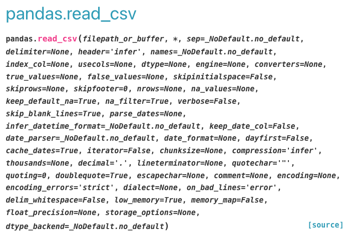

---
jupytext:
  text_representation:
    extension: .md
    format_name: myst
    format_version: 0.13
    jupytext_version: 1.14.0
kernelspec:
  display_name: Python 3 (ipykernel)
  language: python
  name: python3
---

```{code-cell} ipython3
:tags: [remove-cell]

%matplotlib inline
```

# Positional and keyword arguments

Up to now, we called functions using an ordered list of arguments: each argument was assigned using its position. For instance, in this function:

```{code-cell} ipython3
def print_full_name(first_name, last_name):
    """Print the full name of a person."""
    print(f"{first_name} {last_name}")
```

We know that the first argument should be the first name, followed by the last name. This is known as **positional arguments**. We would call this function using:

```{code-cell} ipython3
print_full_name("Catherina", "Smith")
```


In Python, it is also possible to call functions using **keyword arguments**. To do so, we directly assign values to the argument names using `=` signs. This can make the code still clearer:

```{code-cell} ipython3
print_full_name(first_name="Catherina", last_name="Smith")
```

Note that keyword arguments can be assigned in any order:

```{code-cell} ipython3
print_full_name(last_name="Smith", first_name="Catherina")
```

For very simple functions, using keyword arguments is not that useful. However, some functions may have lots of arguments, with many of them being optional. For example, let's look at the signature of Pandas' {{pd_read_csv}} function (we will use Pandas later), in {numref}`fig_pandas_read_csv_signature`.

````{figure-md} fig_pandas_read_csv_signature
:width: 6in


Signature of pandas.read_csv.
````


It has an awful lot of arguments, most of them being optional. In this case, it makes no sense to remember their order: using keyword arguments is much preferred.

:::{tip}
We can use both positional and keyword arguments in a same function call. We begin with the positional arguments, which are being assigned based on their order, and end with the keyword arguments:

```
pandas.read_csv(filename, delimiter=',')
```
:::

:::{note}
In some function signatures, you may sometimes see these symbols: `/` and `*`.
- Any argument that comes before a `/` symbol must be a positional argument.
- Any argument that comes after a `*` symbol must be a keyword argument.
:::
